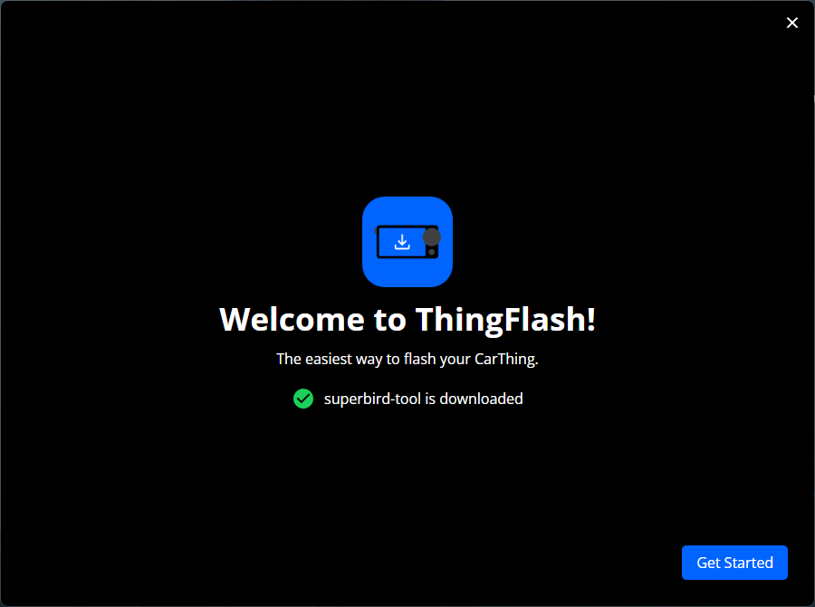
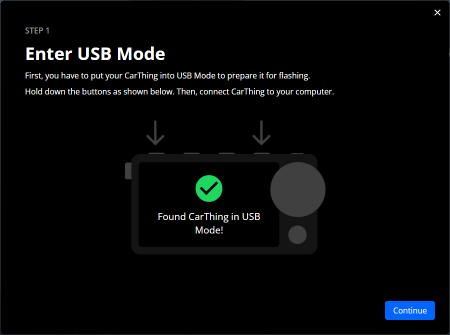
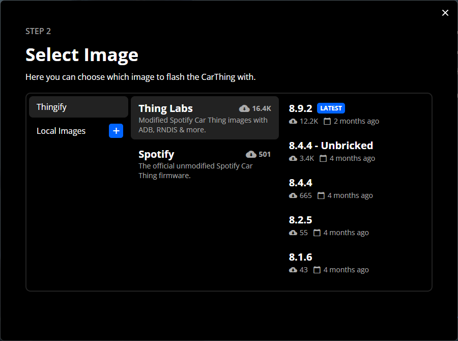
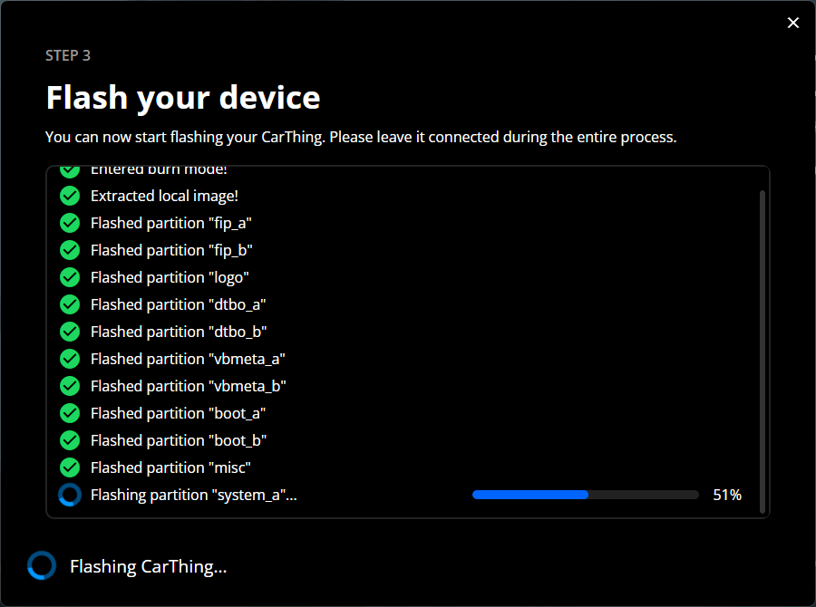
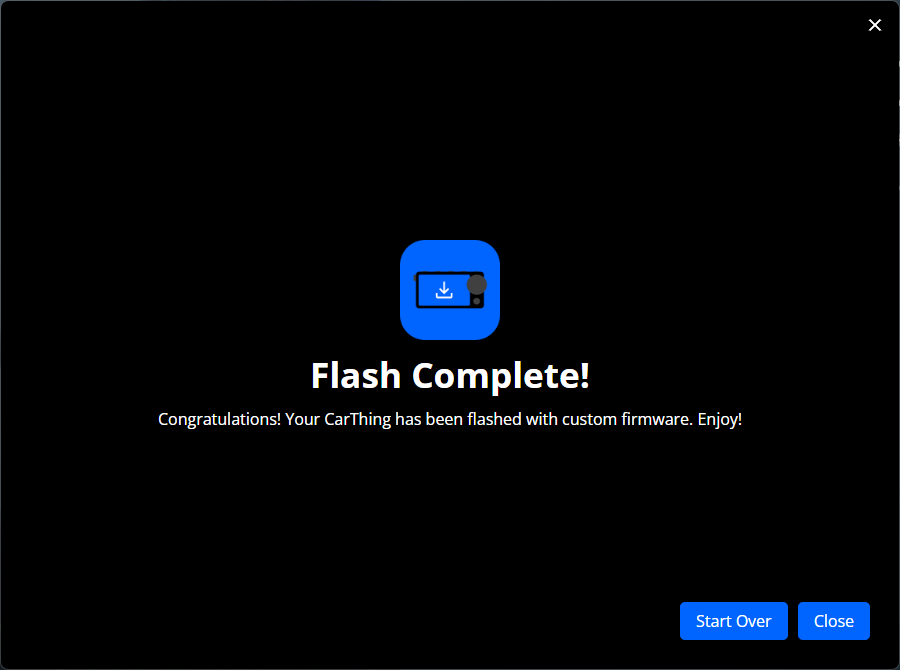

# ThingFlash

The easiest way to flash your CarThing.

## Features

- Guided process for preparing the CarThing, choosing images and flashing
- Supports downloading images from [Thingify](https://thingify.tools/) or using locally saved images
- Uses [`superbird-tool`](https://github.com/BluDood/superbird-tool) under the hood for flashing, automatically downloaded
- Uses [`libwdi_tool`](https://github.com/BluDood/libwdi_tool) on Windows for managing drivers

## Getting started

The application is supported on Windows, Mac and Linux.

1. Download ThingFlash from [Releases](../../releases/).
2. Open the downloaded file to install
3. Open the ThingFlash application

## Usage

1. First, the application prompts you to install superbird-tool. This is a one-click step, and will automatically download and extract the superbird-tool executable.
2. On the next page, you will see the process of enabling USB mode on your CarThing. When that is enabled, click "Find Car Thing" to check for the device. On Windows, this will also automatically install the correct driver for communicating with the CarThing.

   

3. Next, you will choose the image to flash on the CarThing. You can either choose images from Thingify, or choose "Local Images" and select a local image to flash.

   

4. Now simply press "Start Flashing", and you will see a detailed log window which shows current progress of the flashing. This will automatically prepare your CarThing for flashing, download and/or extract the selected image, and then start flashing the device. After the process is done, ThingFlash will reboot and the device, and it should be ready for use.

   

5. On the final page, you will have the option to flash again, or exit the program.

   

## Support

If you are encountering any issues with ThingFlash, feel free to open an issue in this repository. You can also join my [discord server](https://discord.bludood.com)

## Credits

This application is essentially a wrapper for [`superbird-tool`](https://github.com/thinglabsoss/superbird-tool), so all credits for the flashing logic goes to them. This application aims to do all the "hard" steps so the user never has to touch the command line.
